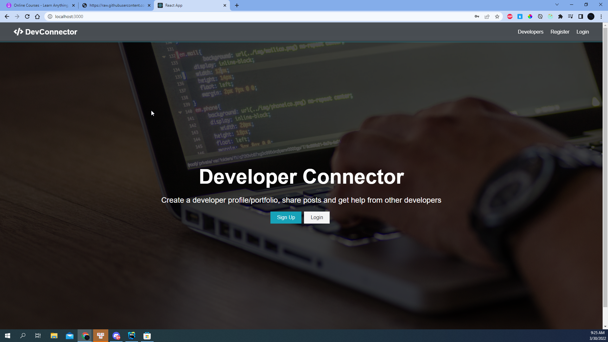
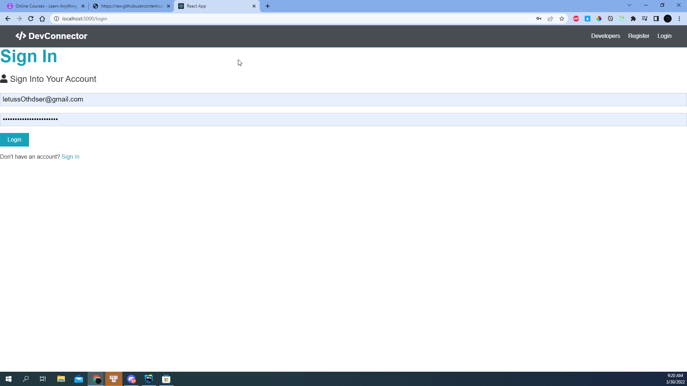
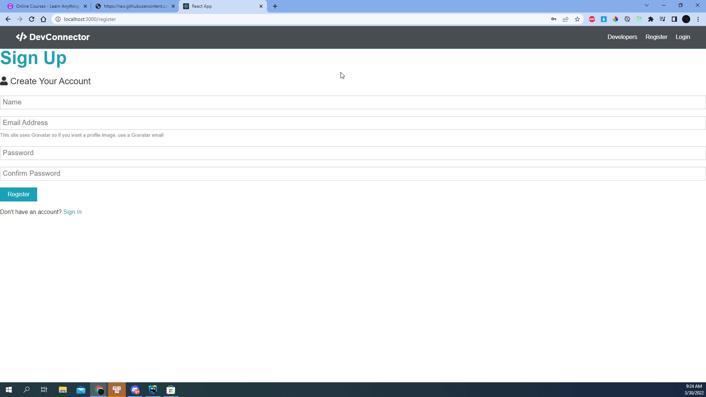
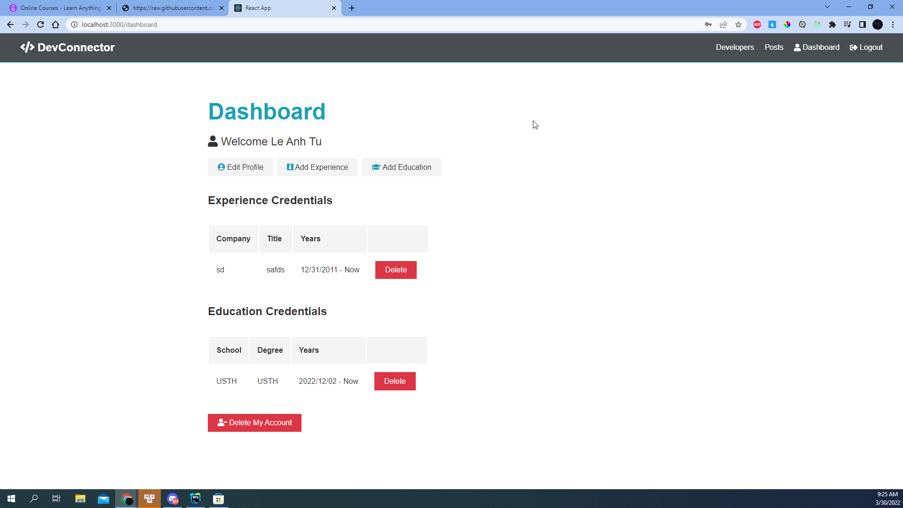
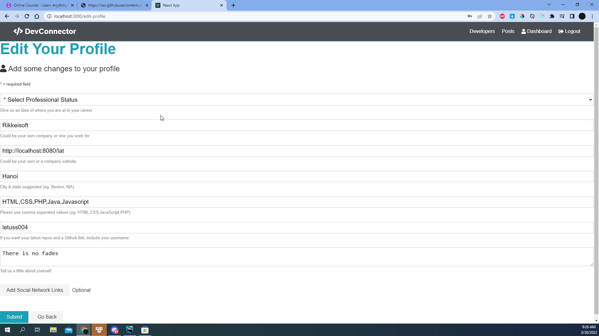
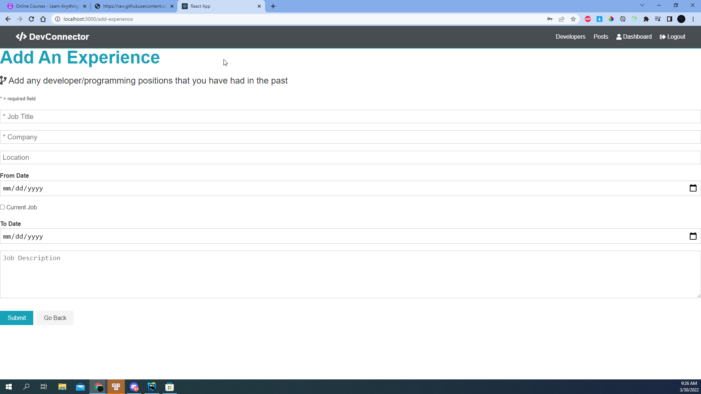
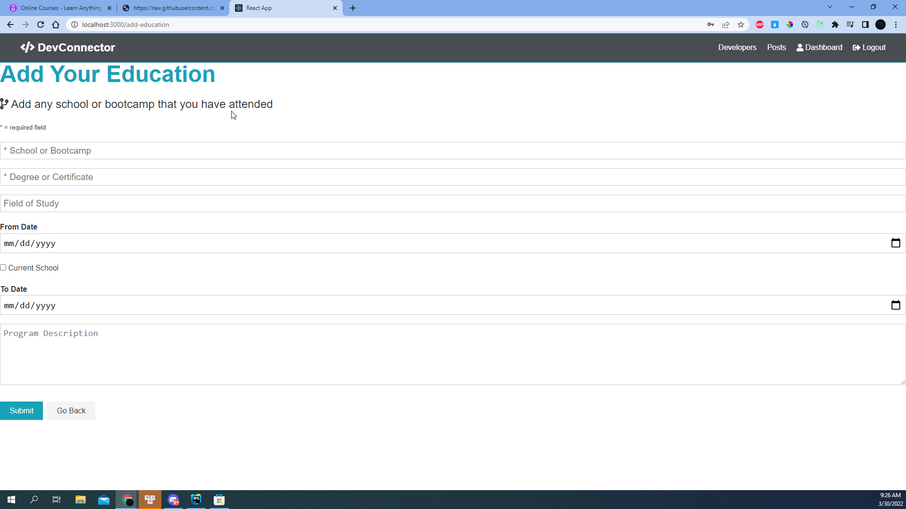
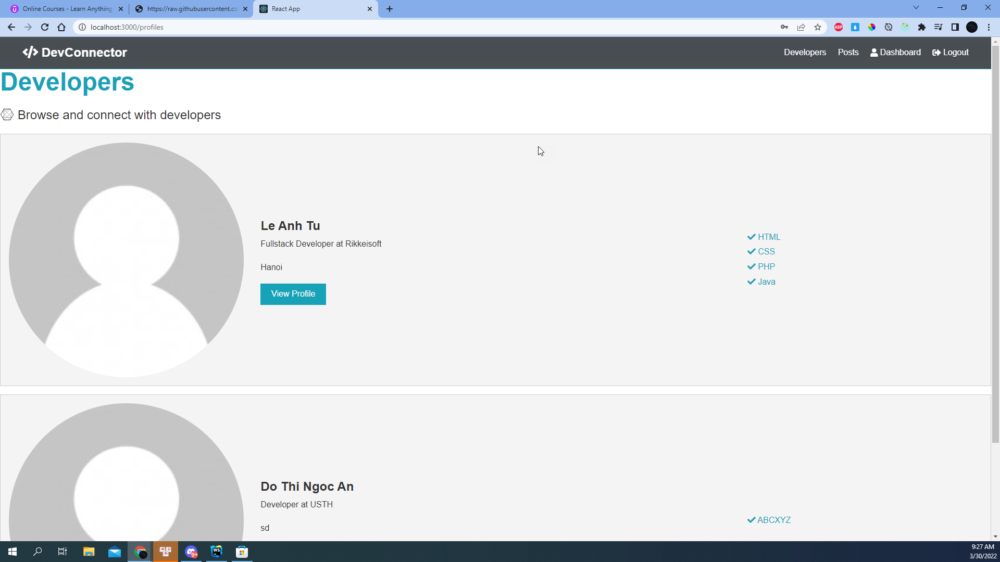
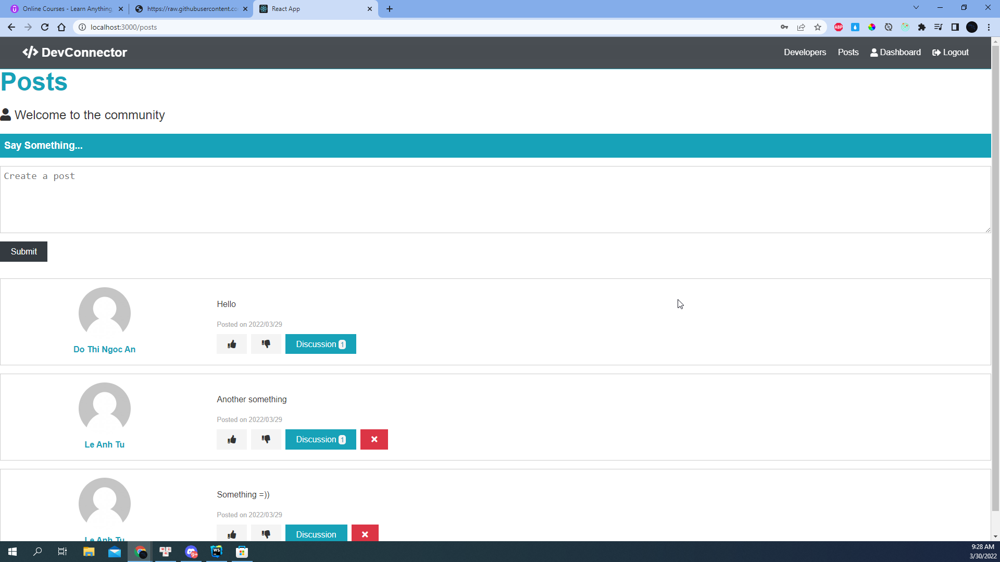

# Training Report: Developer Connector

##### Le Anh Tu - NV0002060

 

## I/ Introduction

### 1. What DevConnector?

&ensp;&ensp;&ensp; Developer Connector is a fullstack Javascript application that build in MERN. It's a small social
network for developers and user can register, create a pretty extensive profile with many fields. I'm going to build a
NodeJs API with authentication and then a front end with state management, multiple reducers and a bunch of UI
components.

&ensp;&ensp;&ensp; In this project, I won't talk about "Implementation" because it already presented in Udemy. I will
focus on result and what I have done.

### 2. Environment

- OS: Windows 10, Kali Linux
- Env: Javascript ES6
- Database: MongoDB
- Framework: Express, React, Node

## II/ Result

 
Figure 1: Landing page

 

 
Figure 2: Login 

 

 
Figure 3: Register  

 

 
Figure 4: User Dashboard 

 

 
Figure 5: User profile edit 

 

 
Figure 6: User profile  

 

 
Figure 7: User add education

 

 
Figure 8: All developer

 

 
Figure 9: All posts

 

## III/ Conclusion

### 1. What I have done

- A fullstack application with expected functionality
- MERN basic concept understanding
- Redux, React first look
- Nodejs API intermediate knowledge

### 2. What I haven't done

- In spite of a fullstack js application, I also feel it not going to detail, just a basic concept
- I have understood React and Redux but just for a small range because this is first time I have met them.
- The same thing happened with NodeJS

